## Revision #4
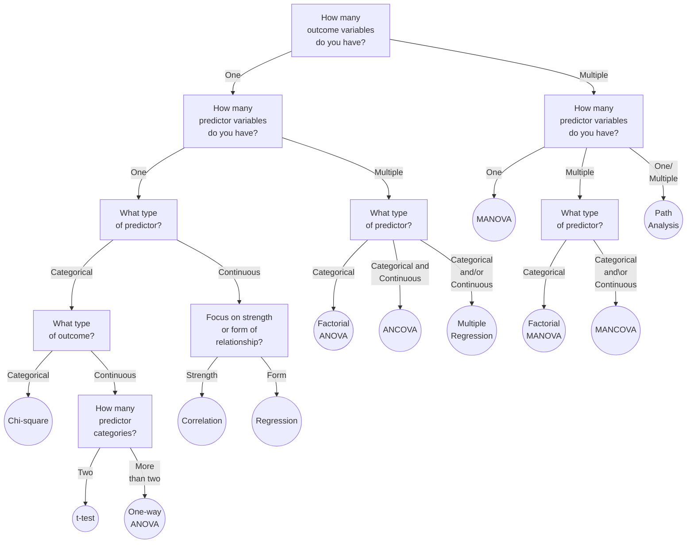
### One outcome, one predictor
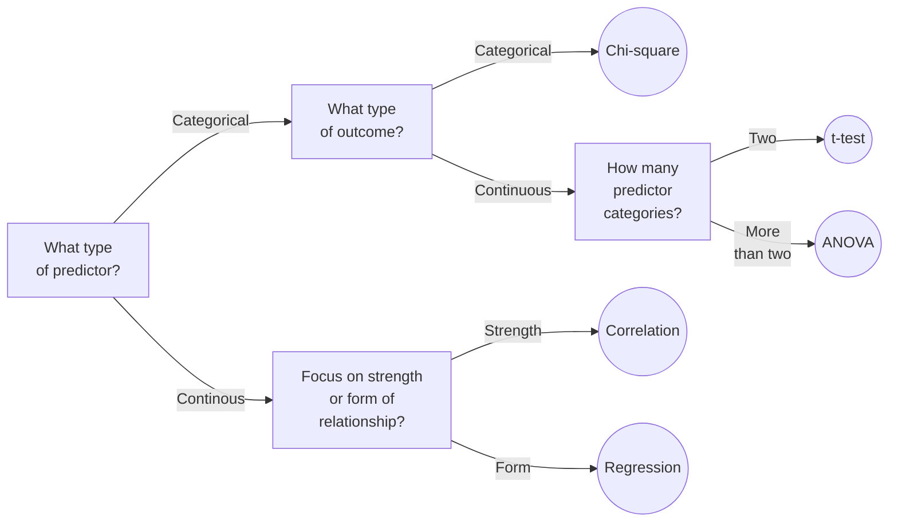
### One outcome, multiple predictors
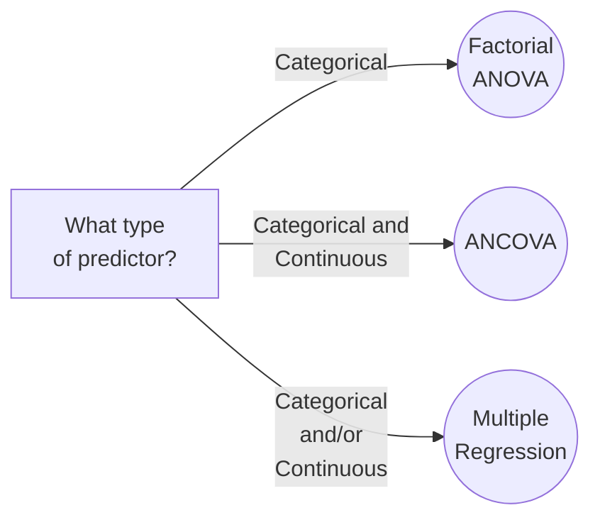

### Multiple outcomes
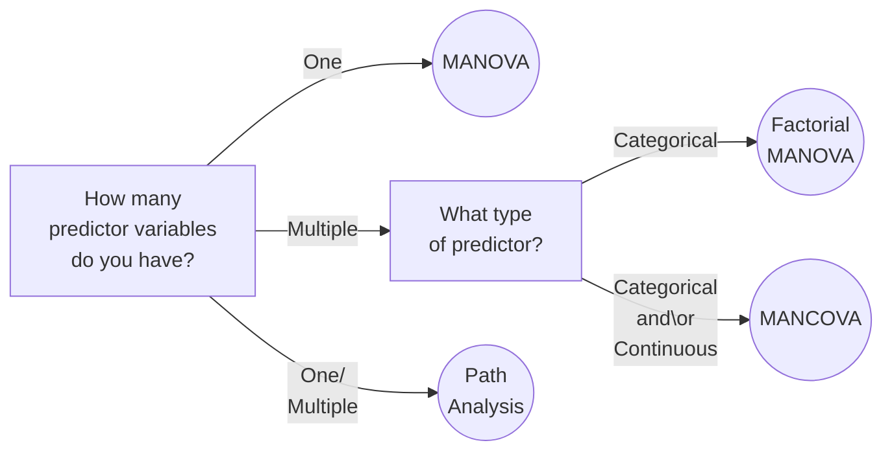
## Revision #3
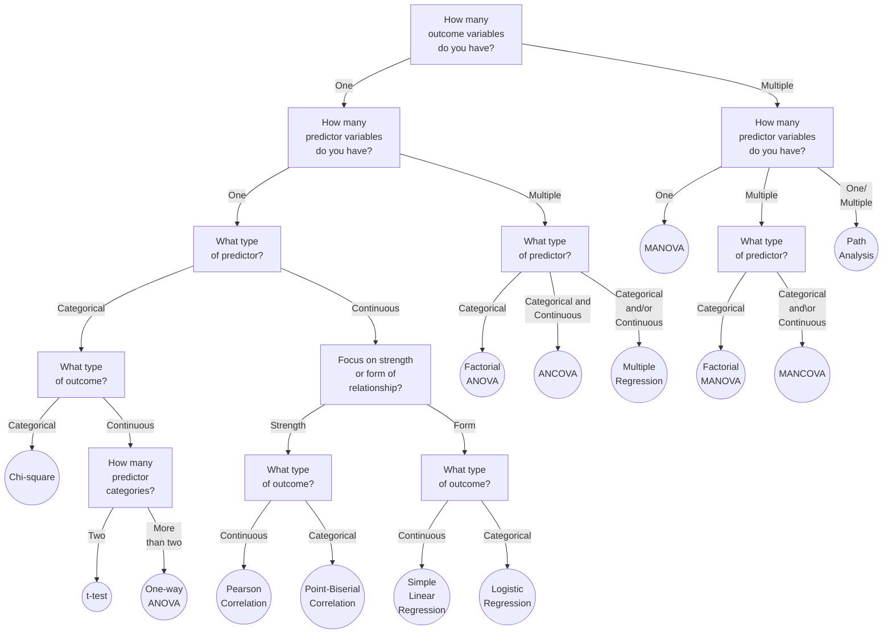
## Revision #2 Full
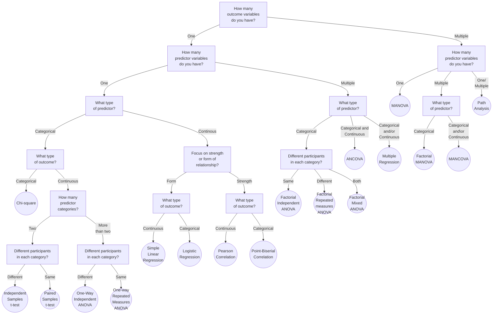

### One outcome, one predictor
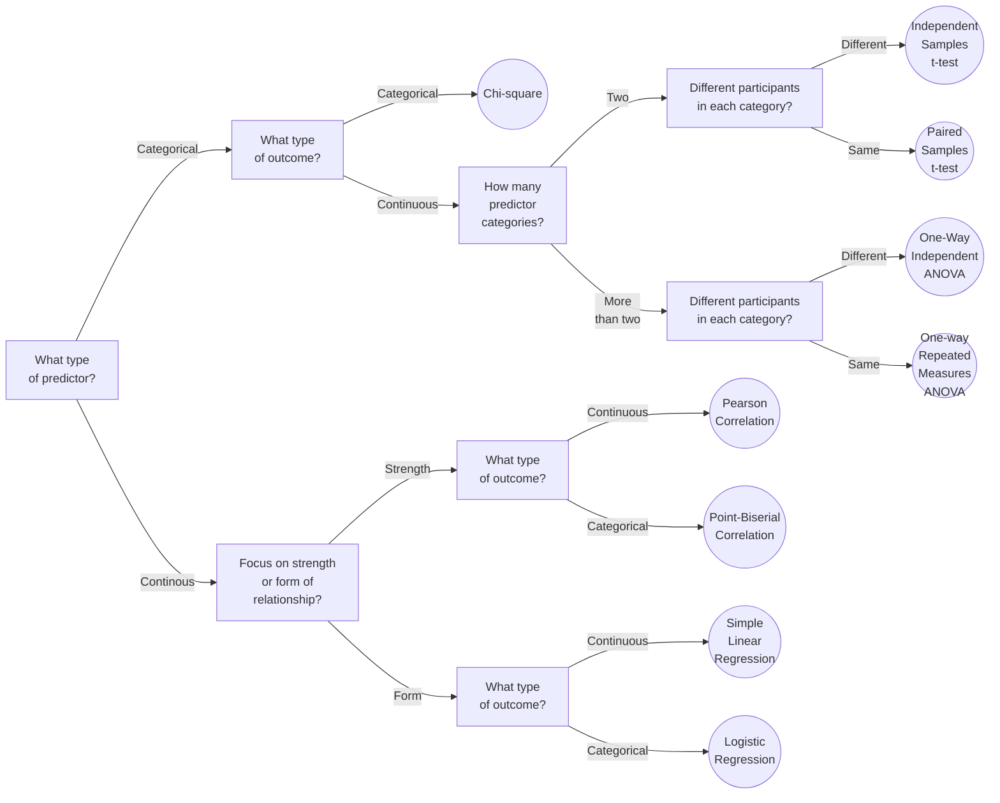

### One outcome, multiple predictors
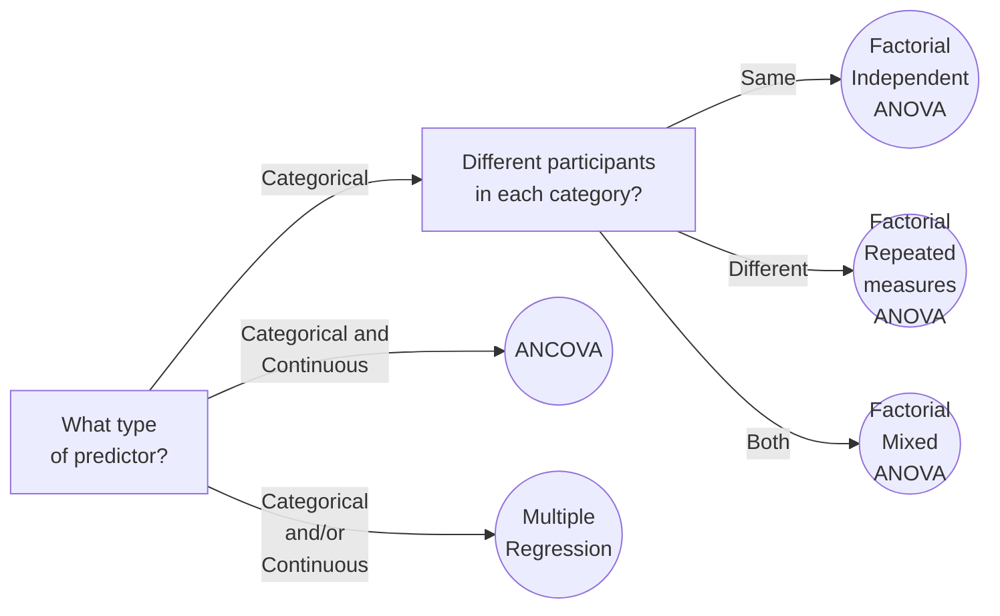

### Multiple Outcomes

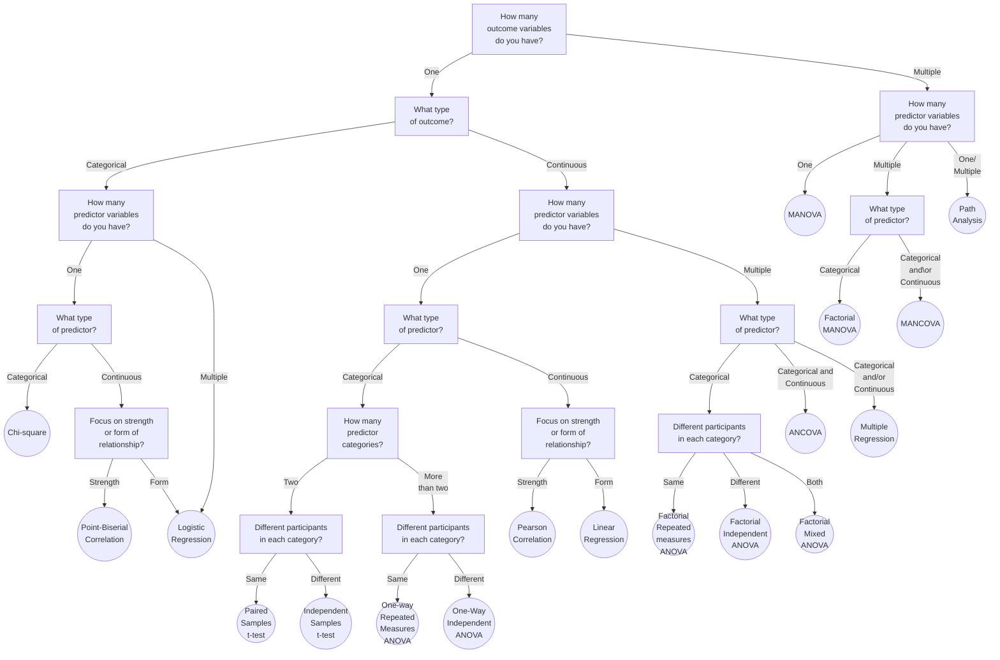

## Statistical Test Flowchart
### Single categorical outcome variables:
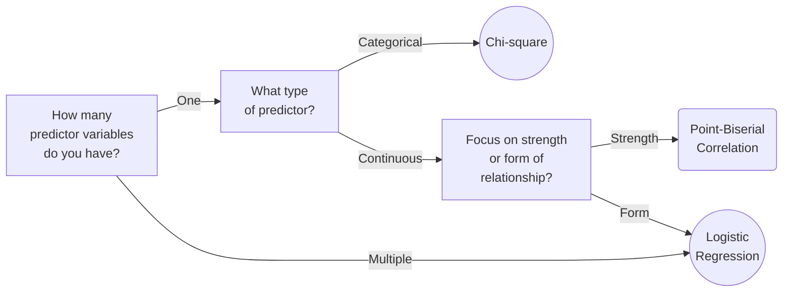
### Single continuous outcome variables:
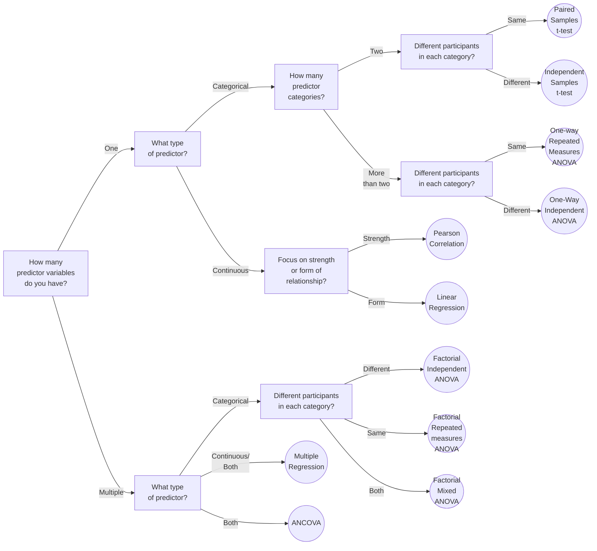
### Multiple outcome variables:
